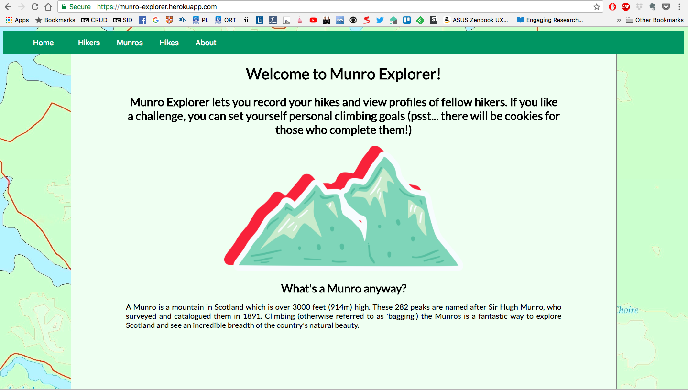

<h1>Munro bagging web app</h1>

A web app built using Ruby, Sinatra, Postgres, HTML and CSS over the course of six days (project 1 of CodeClan's 16-week software development course). For this project, I defined my own spec for an easy-to-use app allowing hikers to keep track of Munros (mountains in Scotland with a height over 3,000 feet) they climbed. I wanted hikers to have individual profiles displaying basic information about them and stats of their walks, as well as be able to browse through a list of Munros, create new hikes and view them as a list. During the project week, I spent the first two days considering user needs and app structure, I dedicated one day building my MVP, one day implementing extensions, and two days working on the visual design of the app.

<h2>Learning objectives:</h2>
<ul>
  <li>build a web app using HTML, CSS (with Flexbox for responsive design) and Sinatra (web framework written in Ruby),</li>
  <li>practice CRUD actions (Create, Read, Update, Delete),</li>
  <li>practice using the <a href="https://learn.co/lessons/sinatra-restful-routes-readme">7 RESTful routes</a>,</li>
  <li>implement a database using Postgres,</li>
  <li>practice good UX design through creating user stories, user journeys, proto-personas, wireframes, and using them throughout the project.</li>
  <li>deploy a web app</li>
</ul>

<h2>MVP:</h2>

<ul>
  <li>Display a list of hikers</li>
  <li>Show individual hikers and see a list of all Munros they've climbed</li>
  <li>Display a list of Munros</li>
  <li>Show individual Munros and see how many hikers have climbed it</li>
  <li>View all hikes (ordered by the latest)</li>
  <li>Create new hikes</li>
  <li>Create new hikers</li>
</ul>

### Possible Extensions:

<ul>
  <li>Display the highest Munro climbed for each hiker</li>
  <li>Add a difficulty level to each Munro; display the most difficult Munro for each hiker</li>
  <li>View hikes by region</li>
  <li>Allow hikers to have personal goals (e.g. climb 10 Munros)</li>
</ul>

### What NOT to use (as per original instructions for the project):
<ul>
  <li>Any Object Relational Mapper (e.g. ActiveRecord)</li>
  <li>JavaScript. At all. Don't even think about it</li>
  <li>Authentication</li>
</ul>

### MunroExplorer is now available online at http://munro-explorer.herokuapp.com

